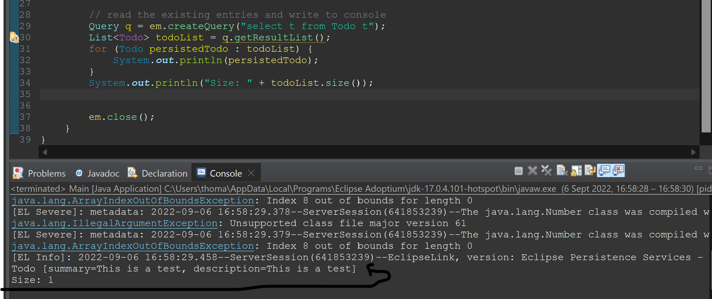

# Dat 250 expass2
In this lab the goal was to get to know the Java Persistence Architecture (JPA). This included following a tutorial for setting up a database for experimentation and then experimenting on object-relational mapping.

## Setting up the environment
Once I figured out where in the tutorial to begin the setup went quite smooth. I cloned the example code from the Github repository and Maven took care of the rest in my Eclipse IDE. Unfortunately I forgot to fork the repository, something I had to amend by reinitializing Git locally and changing upstream repository later in the process.

## Experiment 1
I followed the guide thouroughly and got the code in experiment1 to run. However, myriads of these error messages appear when I run my code, indicating lack of support for my java version (17.0.4.1).
`
[EL Severe]: metadata: 2022-09-06 20:55:43.448--ServerSession(1920467934)--The java.lang.Object class was compiled with an unsupported JDK. Report this error to the EclipseLink open source project.
java.lang.IllegalArgumentException: Unsupported class file major version 61
`

` 
[EL Severe]: metadata: 2022-09-06 20:55:43.453--ServerSession(1920467934)--The java.lang.Object class was compiled with an unsupported JDK. Report this error to the EclipseLink open source project
`

It didn't seem to affect anything else in my environment so I let it be for now. 

An actual problem was displaying the data in the database. I used some time to research the architecture of the Derby database, but most of the articles I found were very old. One article claimed that Eclipse had functionality for this, but the UI had been redesigned since the article was written and I didn't find it. I also took a look at setting up a server, but the download webpage looked really old and I didn't really understand what I was doing so I decided to find some software to help me instead. All the software I found was also very outdated, so I ended up writing a class `pObjectRetriever` (Persisted Object Retriever) which used the generalized logic from the experiment1 `main.js` to retrieve persisted objects and print them to the console. The result for experiment1 looked like this:

## Experiment 2
Experiment2 proved more challenging than experiment1. It took me some time to get used to the syntax, and I couldn't find the right lecture notes at first. I found the lecture notes, and after a while I got the hang of it, it just took some time to get the code written down. When I was closed to finished I noticed the tests... Unfortunately I had used ArrayLists where the tests were looking for Set. I started amending the problem by changing to Set's in `Person`, but I didn't bother to do this everywhere else as I didn't see this as a crucial part of the task. I commented out the code, and let my database inspecting code prove that the persistence worked instead:

## Summary
As with all labs, the task took longer than expected. However, in hindsight I didn't think it was very hard, I just struggled to find updated documentation and overlooked some details.

My code can be found [here](https://github.com/thomassihvl/Lab2_DAT250).
