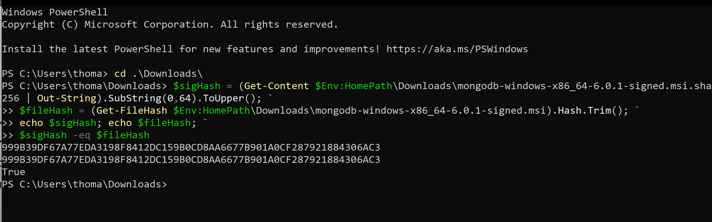
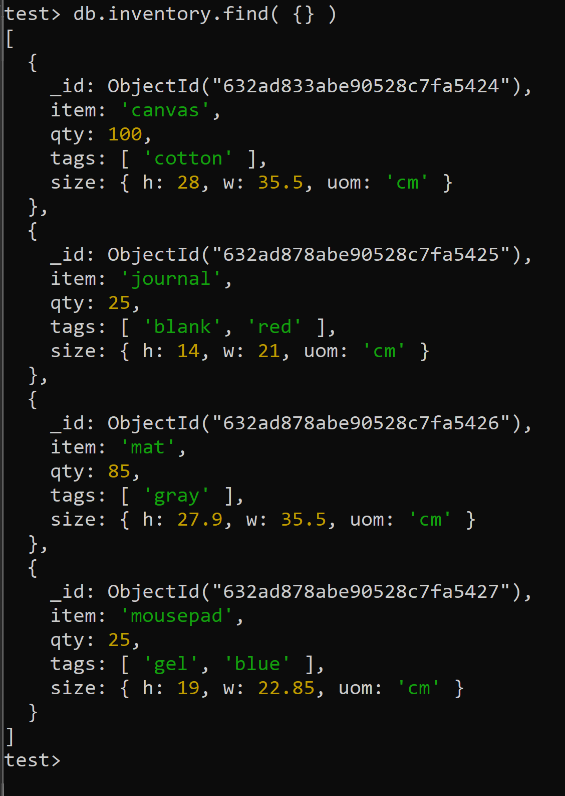
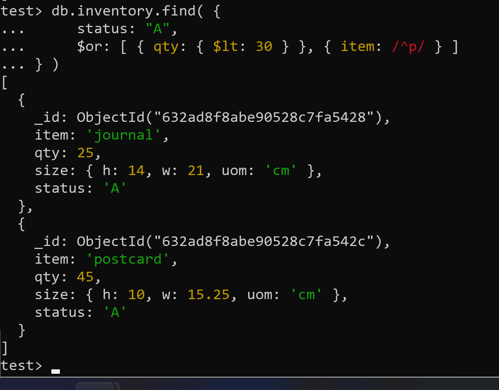
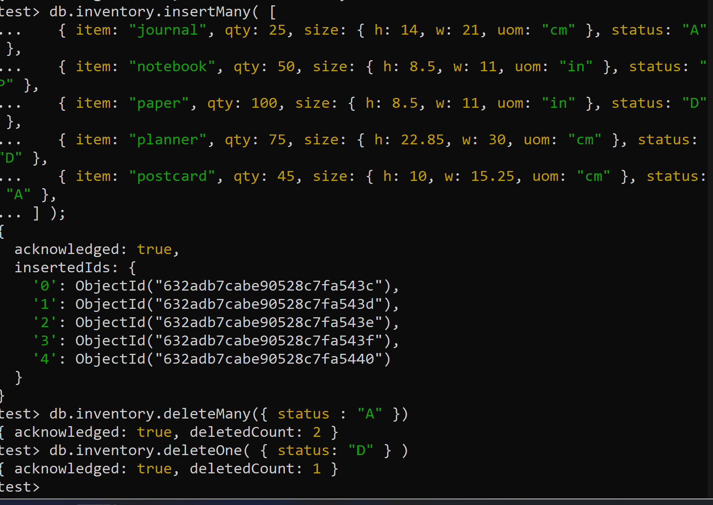
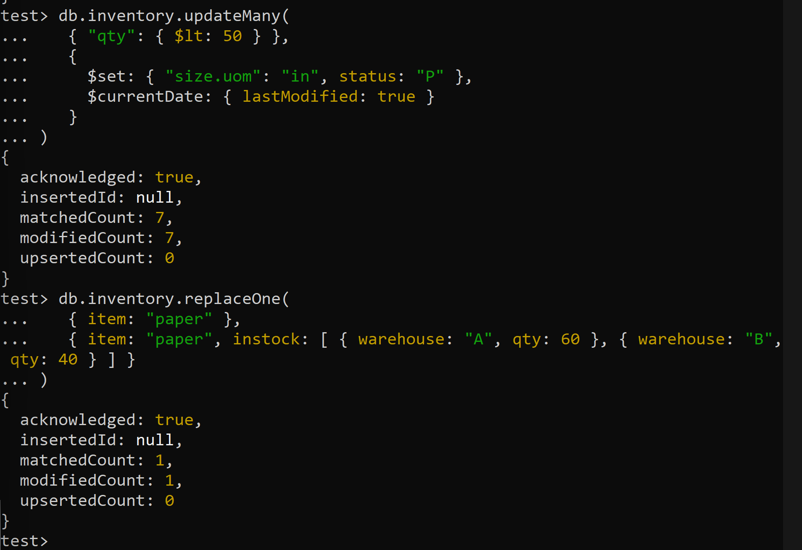
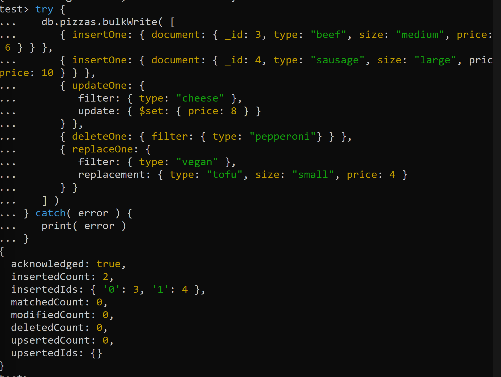
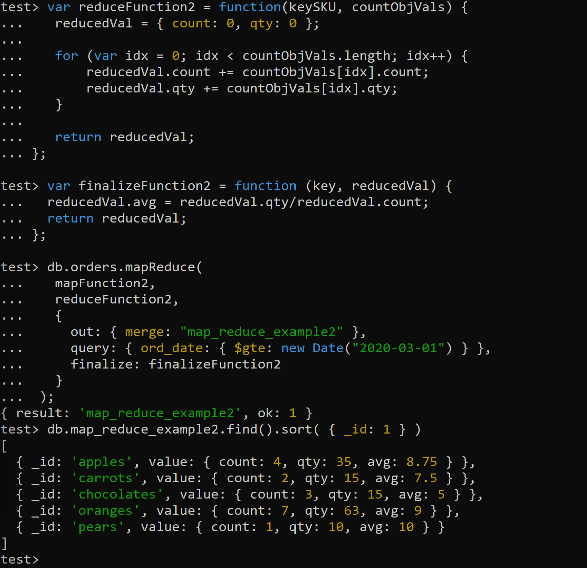
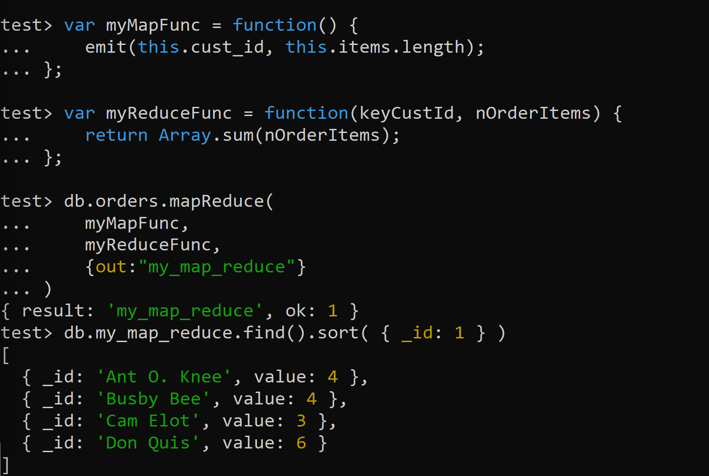

# DAT250 expass 3
I followed the tutorials closely and all went well. I encountered a explanatory gap where the tutorial didn't tell me where my mongodb.exe had been installed when it told me to set the PATH, but I found it myself.

## Installation Validation


## Insert Operations


## Query Operations


## Delete Operations


## Update Operations


## Bulk Write


## Example 2 Working Example


## My Map Reduce
```
// Return total orders per customer
var myMapFunc = function() {
	emit(this.cust_id, this.items.length);
};

var myReduceFunc = function(keyCustId, nOrderItems) {
	return Array.sum(nOrderItems);
};
```

